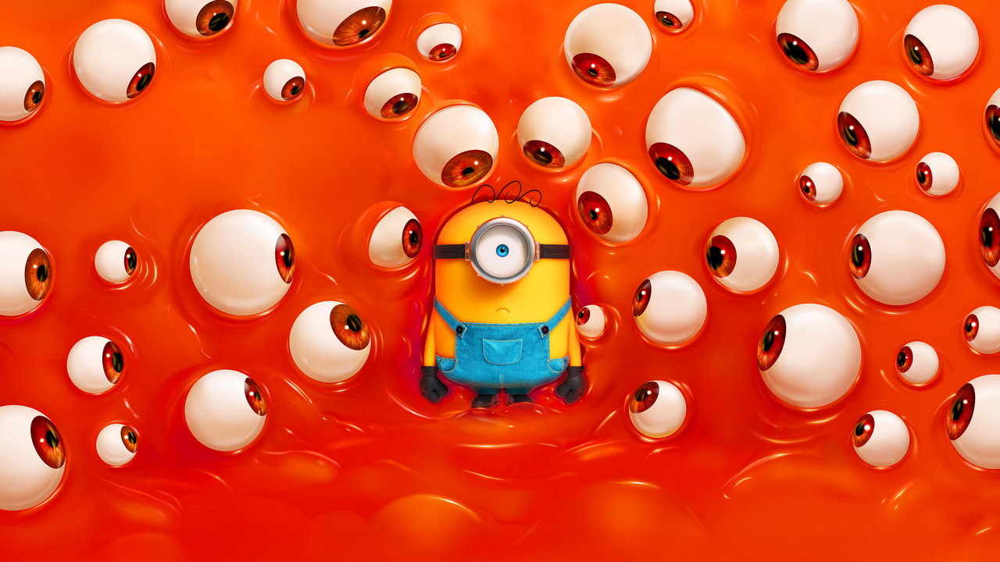
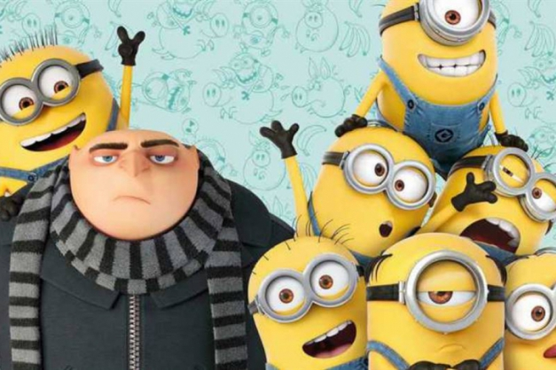
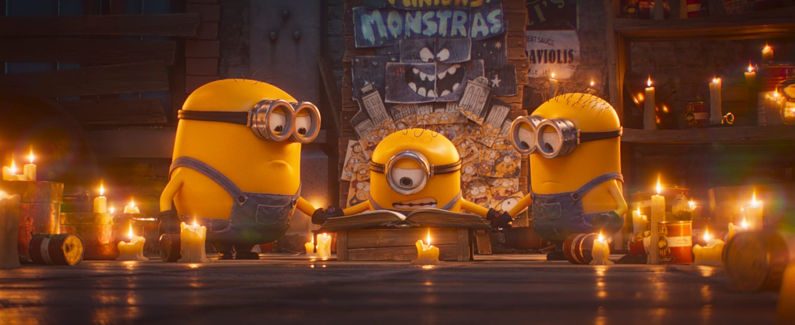
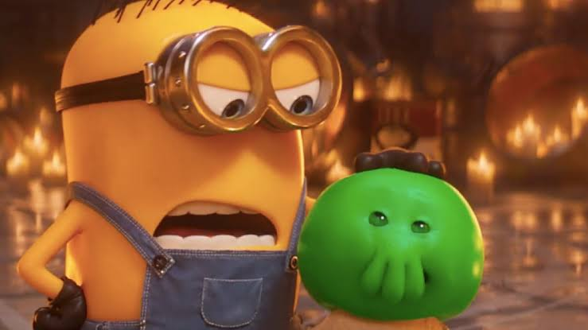

# Por que os vilões dos desenhos de hoje são mais amados que os heróis?

*Divulgação/Universal Pictures — arte oficial de "Minions & Monstros" (2026)*

Seu filho já saiu do cinema torcendo pro lado errado da história?

Se ele assistiu a qualquer filme da franquia *Meu Malvado Favorito* (Minions e Gru), a resposta provavelmente é sim — e não por acidente de roteiro. É o motor da história. A pergunta que move esses filmes nunca foi "quem é bom o suficiente para eu seguir?". É "quem é malvado o suficiente para merecer minha lealdade?".

## Do vilão bobo ao vilão "mestre"

Por décadas, o vilão de desenho era a piada da história: perdia sempre, era ridicularizado, existia pra criança rir *dele*, não *com ele*. A virada que a Illumination fez com essa franquia foi diferente — e funcionou tão bem que virou o motor de sete filmes até agora. Em vez de rir do vilão, a plateia é convidada a torcer por ele. Em vez de admirar quem resiste ao mal, a criança acompanha personagens (os Minions) cujo único propósito declarado é *encontrar alguém mau o bastante pra servir*.

Isso não é subtexto. É o enredo.

## Como funciona o mecanismo: carisma chega antes do juízo moral

O truque é simples e é por isso que funciona tão bem em crianças pequenas: a comédia física, o design fofo e a ausência de consequência real anestesiam o julgamento moral antes que ele aconteça. A criança ri primeiro, e só depois — se depois — percebe o que estava rindo. Quando o humor vem tão rápido e a violência é tão consequência-zero (ninguém morre de verdade, ninguém sofre de verdade), fica muito difícil para uma criança de 6 anos separar "isso é engraçado" de "isso é certo".

Três cenas mostram esse mecanismo com clareza:

**1. A Convenção dos Vilões (*Minions*, 2015).** O filme abre mostrando os Minions perdendo mestre atrás de mestre ao longo da história — um T-Rex, homens das cavernas, um faraó egípcio, Napoleão, Drácula — sempre por incompetência própria. Sem chefe, eles caem em depressão coletiva na Antártida. A solução? Viajar até a Comic-Con dos supervilões pra encontrar a próxima "chefona". Eles escolhem Scarlet Overkill não porque ela é gentil ou justa, mas porque ela é apresentada como a vilã mais malvada do mundo. O critério de escolha é explicitamente esse.

**2. O apego à versão "vilão" de Gru (*Meu Malvado Favorito*, 2010).** Ao longo do primeiro filme, à medida que Gru se aproxima das três meninas adotadas e começa a amolecer, boa parte do humor vem justamente da estranheza dos Minions com essa mudança — a comédia trata a bondade dele como desvio, e a travessura/malvadeza como o estado "normal" e divertido do personagem.

*Divulgação/Universal Pictures — Gru e os Minions, os protagonistas cuja graça sempre esteve ligada à travessura*

**3. Em busca de um novo mestre malvado (*Minions & Monstros*, 2026 — em cartaz nos cinemas desde 2 de julho).** No mais novo filme da franquia, uma tribo diferente de Minions vira sensação de Hollywood nos anos 1920 — até a chegada do cinema falado acabar com a fama deles, que não conseguem seguir roteiro em Minionês. Destituídos e sem rumo, eles vagam pelas ruas "à procura de um propósito — e de um novo mestre malvado para servir". A trama literalmente recomeça o ciclo: perder o mestre, sair à caça do próximo malvado.

*Divulgação/Universal Pictures — os Minions "produzindo" seu próprio filme de monstro em Minions & Monstros*

Repare no padrão: em três filmes diferentes, ao longo de dez anos de franquia, a régua de valor pra esses personagens nunca muda. Não é "encontrar alguém bom". É "encontrar alguém mau o bastante".

## O que isso ensina a uma criança de 6 anos

Nenhuma criança sai do cinema repetindo "devo servir o mal". O ensino é mais sutil e, por isso, mais eficaz: a história associa maldade a competência, charme, humor e pertencimento — e bondade a chatice, hesitação ou motivo de piada interna do grupo. A criança não aprende uma doutrina, aprende uma sensação: ser malvado é engraçado, cheio de amigos e nunca dá em nada ruim; ser bom é o desvio estranho que o grupo tolera.

Some a isso um detalhe concreto: crianças no mundo inteiro compram fantasia de macacão e óculos de Minion — a estética dos personagens virou desejo real de consumo. A identificação não fica na tela.

## A estratégia por trás da tela

Não estamos falando de teoria da conspiração, nem de caçar símbolo escondido quadro a quadro. É mais simples — e mais estratégico — que isso: quando uma história repete, filme após filme, que "seguir o mais malvado é a escolha divertida e recompensadora", ela treina uma plateia inteira a achar normal, até desejável, colocar a lealdade no lugar errado.

A Bíblia já nomeou esse movimento: *"Ai dos que ao mal chamam bem, e ao bem mal; que fazem das trevas luz, e da luz trevas"* (Isaías 5:20). Não é preciso que um filme carregue uma mensagem explicitamente satânica pra cumprir esse papel — basta tornar o mal atraente, competente e engraçado o bastante pra parecer referência legítima. É essa a estratégia do inimigo: não convencer ninguém a admirar o mal abertamente, mas dessensibilizar aos poucos, até a linha entre "isso é só entretenimento" e "isso é o que eu acho normal" desaparecer.

*Divulgação/Universal Pictures — Goomi, o personagem que literalmente guia os Minions até o próximo "mestre malvado" em Minions & Monstros*

Repare até no detalhe: em "Minions & Monstros", quem ajuda os protagonistas a encontrar o próximo mestre é Goomi — uma criatura desenhada pra ser fofa, não ameaçadora. O guia rumo ao mal também precisa ser simpático. É assim que a estratégia funciona melhor: não com uma cara assustadora, mas com uma cara de desenho animado.

Isso não torna toda comédia com vilão carismático um ataque espiritual direto à sua família. Torna discernimento um trabalho — e esse trabalho é espiritual, não só educativo. Cuidar do que entra na tela de casa é parte do mesmo zelo que todo pai cristão já exerce sobre o que entra pelo ouvido e pelo coração dos filhos.

## O que fazer: a pergunta certa depois do filme

Não adianta proibir o filme — ele está em cartaz, nos brinquedos, no lanche da escola. O que funciona é usar a própria pergunta que o filme faz e virar ela pro lado certo. Depois de assistir, pergunte:

> "Por que você acha que os Minions preferem servir alguém malvado?"

Deixe a criança tentar responder. Na sequência, pergunte:

> "Teve algum momento do filme em que ser bom também deu certo? Por que você acha que esse pedaço foi mais rápido ou menos engraçado que o resto?"

Essas duas perguntas fazem o trabalho que o filme não faz sozinho: elas tiram a bondade do lugar de "coadjuvante sem graça" e colocam de volta como escolha que vale a pena — sem transformar a conversa em sermão.

## O convite da GodFlix

Identificar o padrão é o primeiro passo. Mudar ele é o segundo — e isso não se resolve só com crítica.

O GodFlix nasceu para isso: uma convocação a cristãos em todo o Brasil para apoiar e financiar produções brasileiras e cristãs — histórias em que o herói é engraçado, é cativante, é quem a criança quer imitar, *porque* ele é bom, não apesar disso. Não é sobre esperar que alguém faça esse conteúdo por nós. É sobre construir juntos.

Se é isso que você quer para a sua casa e para a próxima geração, junte-se a nós.

**[Saiba mais sobre o GodFlix →](LINK-SAIBA-MAIS)** &nbsp;·&nbsp; **[Faça uma avaliação gratuita →](LINK-AVALIACAO)**

---

**Notas internas (não publicar):**
- Substituir `LINK-SAIBA-MAIS` e `LINK-AVALIACAO` pelas URLs reais antes de publicar. "Faça uma avaliação" ainda não tem destino definido — confirmar se é um formulário/quiz ou outra página, já que o GodFlix hoje é movimento de apoio/financiamento, não catálogo.
- Revisar se a data e os detalhes de *Minions & Monstros* seguem batendo com a estreia local — checados em 15/08/2026 via cobertura de imprensa (Omelete, AdoroCinema, IMDb, NBC Insider). Ajustar caso a distribuição no Brasil tenha mudado.
- Imagens salvas em `imagens/` nesta mesma pasta: `capa-olhos.jpg` (capa), `gru-e-minions-grupo.jpg`, `minions-monstros-set-ritual.jpg` e `goomi-e-minion.jpg` (baixadas pelo usuário de fontes de imprensa/IMDb, mais `capa-olhos.jpg` obtida via TMDB). Todas landscape. Crédito ao publicar: "Divulgação/Universal Pictures".
